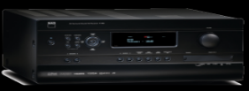
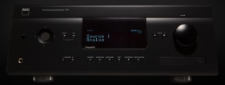

# NAD Electronics - Audio/Video Receiver Binding


This binding integrates NAD Surround Sound Receivers/Amplifiers via **Telnet** using: <ul><li>an IP Ethernet connection on devices that have an Ethernet(LAN) port</li><li>or serial RS-232 interface using an IP to Serial converter (for example Global Cache's [WF2SL](https://www.globalcache.com/products/itach/wf2slspecs/), [IT2SL](https://www.globalcache.com/products/itach/ip2slspecs/), USR IOT's [USR-TCP232-302](https://www.pusr.com/products/1-port-rs232-to-ethernet-converters-usr-tcp232-302.html), etc)</li></ul>

Integration details can be found in the NAD Electronics command protocol documentation  here: [Protocol Integration Documentation](https://nadelectronics.com/software/#Protocol)

The binding has been tested with an NAD T-787 using: <ul><li>a direct Ethernet (LAN) connection on the receiver via Telnet(TCP)</li> <li> and with an [XM Direct Home Tuner](https://shop.siriusxm.com/support/xm-direct-home-tuner.html) connected to the T-787</li></ul>  

>DAB Tuner functionality has been included in the binding, but has not been tested.  
The NAD control protocol is limiting DAB channels to _read-only_; presets can be used to change stations.

## Supported Things

| Thing | Type | Description | Connection | Zones | Tested |
|:-:|:-:|:--|-------|:-:|:-:|
|  | T765 | Connection to NAD T-765 Surround Sound Receiver | Serial RS232 | 4 | &#10060; No |
|  | T775 | Connection to NAD T-775 Surround Sound Receiver | Serial RS232 | 4 | &#10060; No |
|  | T785 | Connection to NAD T-778 Surround Sound Receiver | Serial RS232 | 4 | &#10060; No |
|  | T187 | Connection to NAD T-187 Surround Sound Pre-Amplifier  | Ethernet | 4 |&#10060; No |
|  | T777 | Connection to NAD T-777 Surround Sound Receiver | Ethernet | 4 | &#10060; No |
|  | T787 | Connection to NAD T-787 Surround Sound Receiver | Ethernet | 4 | &#9989; Yes |

## Discovery

The binding will auto-discover "support-things" (via mDNS) that are IP connected to the same network as the Open-Hab server.  

Auto discovered things will list the device details in the thing configuration "properties" section in the OpenHab UI.
<ul><li>Serial number (used to create unique thing UID)</li><li>The maximum number of zones the receiver supports</li><li>Model Id ("Type" in supported things)</li><li>Vendor</li></ul>


## Binding Configuration

_If your binding requires or supports general configuration settings, please create a folder ```cfg``` and place the configuration file ```<bindingId>.cfg``` inside it. In this section, you should link to this file and provide some information about the options. The file could e.g. look like:_

```
# Decide if we want to disable autodiscovery 
# 
# Configuration for the NADAvr Binding
#
# Default secret key for the pairing of the NADAvr Thing.
# It has to be between 10-40 (alphanumeric) characters.
# This may be changed by the user for security reasons.
secret=openHABSecret
```
_If your binding does not offer any generic configurations, you can remove this section completely._

## Thing Configuration

The NAD AVR thing has the following configuration parameters:

| Parameter | Parameter Id | Req/Opt | Description | Default |  Type | Accepted Values |
| :--       | :--          | :-:               | :--         | :-:     | :-: | :--             |
| Zone Count of the Receiver | zoneCount | Required | User can configured number of zones to be configured | 2 | Integer | 1 - maxZones listed in Thing properties |  
| Host Name | hostname     | Required          | Host name assigned to device on the local network | | String | Host name or IPv4 address |
| IP Address | ipAddress   | Required          | The IPv4 address assigned the the NAD Receiver | | String | Any valid IPv4 address |
| Port      | telnetPort   | Required           | The network port for Telnet connection | 23 | Integer | Any valid TCP port number |
| Enable Preset Detail | enablePresetNames | Optional | User has provided an xml file listing details for tuner presets | false | Boolean | true or false |
| Preset Names File | presetNamesFilePath | Optional, <br />Required if enablePresetNames = true | File Name containing preset name details including path e.g. ```/etc/openhab/scripts/Preset_Names.xml``` | | String | Valid path and file name |

Since the NAD control protocol does not provide a means to retrieve the descriptive information for tuner presets, this binding provides the option to let the user create a file that can be used to give more meaning to the tuner preset channel.

**Note:** _If the NAD device does not have a tuner, then tuner preset name information will be ignored._

#### Preset Names XML file Example 
Tuner preset descriptions can be stored in an xml file that is then used to override the default (P01 - P40) options you're provided when selecting the tuner preset channel. 

**Steps to create file:**
<table>
<tr>
<th> Step </th> <th> Instructions </th>
</tr>
<tr>
<td> 01 </td>
<td> The template and schema files provided below should be used to simplify creating the preset names file. <ul> <li>Template <a href="doc/Preset_Names.xml">Preset_Names.xml</a> </li><li>Schema <a href="doc/NAD_Preset_Names.xsd">NAD_Preset_Names.xsd</a></li></ul>Follow the links to copy the source code. </td>
</tr>
<tr>
<td> 02 </td>
<td>Open an editor capable of working with and validating XML files like Visual Studio Code, Notepad++.</td>
</tr>
<tr>
<td> 03 </td>
<td>

Decide where you will store the two files you will create.  Recommend you save them in ```/etc/openhab/scripts/``` folder on your OpenHab system.
</td>
</tr>
<tr>
<td> 04 </td>
<td>

Open a new file, name it ```Preset_Names``` saving it with the .xml extension. <br> Open another new file, name it ```NAD_Preset_Names``` saving it with the .xsd extension

</td>
</tr>
<tr>
<td> 05 </td>
<td>

Click on the link for the Schema file, copy and paste the entire contents of the file into your ```NAD_Preset_Names.xsd``` file and save it.
</td>
</tr>
<tr>
<td> 06 </td>
<td>

Click on the link for the Template file, copy and paste the entire contents of the file into your ```Preset_Names.xml``` file and save it.
</td>
</tr>
<tr>
<td> 07 </td>
<td>

Edit the ```Preset_Names.xml``` file with your preset details, replacing the template examples with your details. <br> Depending on the editor, you may or may not have to define where to find the schema to validate your entries.
</td>
</tr>
<tr>
<td> 08 </td>
<td>
The basic XML format should have at the minimum, one or more presets (i.e. child elements) defined between the &lttunerPresets&gt root element.

```xml
<tunerPresets>
    <preset id="01">
        <band>FM</band>
        <frequency>105.70</frequency>
        <name>WAPL</name>
    </preset>
    <preset id="02">
        <band>AM</band>
        <frequency>1150</frequency>
        <name>WHBY</name>
    </preset>
    <preset id="03">
        <band>XM</band>
        <frequency>26</frequency>
        <name>Classic Vinyl</name>
    </preset>
</tunerPresets>
```

</td>
</tr>
<tr>
<td> 09 </td>
<td>XML validation will check for:
<table>
<tr>
<th> Element</th><th>Type</th><th> Validation Test </th>
</tr>
<tr>
<td>id</td><td>Integer</td><td> Two digits 01-40</td>
</tr>
<tr>
<td>band</td><td>String</td><td>FM, AM, XD, or DAB</td>
</tr>
<tr>
<td>frequency</td><td>String</td><td>1-6 characters long</td>
</tr>
<tr>
<td>name</td><td>String</td><td>1-20 characters long</td>
</tr>
</table>
</td>
</tr>
<tr>
<td>10</td><td>

Update the NAD Thing configuration with the preset name file including path e.g. ```/etc/openhab/scripts/Preset_Names.xml``` by clicking on the _Show advanced_ checkbox to display prompts for the tuner preset details.<ul><li>Toggle the Enable Preset Detail switch to On</li><li>Enter the preset name file including path in the Preset Name File prompt</li><li>Save the configuration; the file will be validated by the binding; and check for any error messages</li><li>If the file was found and is a valid format, the binding will be in an Online state</li></ul> 
</td>
</tr>
</table>

## Channels

NAD AVR Thing Channels are listed by Group

**Zone 1 (Main)**
| Channel Type UID  | Item Type   | Access Mode| Description                  |
|:------------------|:------------|:-----------:|:----------------------------|
| zone1#power  | Switch | RW | Main power on/off | 
| zone1#source | String | RW | Input source for the Main zone ("1" - "10")|
| zone1#volume | Dimmer| RW | Volume level for the main zone (1% - 100%) |
| zone1#volumeDB | Number | RW | Volume level of the main zone (-99 to +19 dB) |
| zone1#mute | Switch| RW | Main volume mute on/off |
|zone1#listeningMode | String | RW | The main listening mode for this AVR |

**Zone 2**
| Channel Type UID  | Item Type   | Access Mode| Description                  |
|:------------------|:------------|:-----------:|:----------------------------|
| zone2#power  | Switch | RW | Zone 2 power on/off |
| zone2#source | String | RW | Input source for zone 2 ("1" - "11") |
| zone2#volume | Dimmer | RW |Variable volume level for zone 2 (1% - 100%) |
| zone2#volumeDB | Number | RW |Variable volume level for zone 2 (-99 to +19 dB) |
| zone2#mute | Switch| RW | Zone 2 volume mute on/off|
| zone2#volumeFixedDB | Number | RW | Fixed volume level for zone 2 (-99 to +19 dB) |
| zone2#volumeFixed | Dimmer | RW | Fixed volume level for zone 2 (1% - 100%) |
| zone2#volumeControl | String | RW | Volume control setting for zone 2 (Fixed/Variable)|

**Zone 3**
| Channel Type UID  | Item Type   | Access Mode| Description                  |
|:------------------|:------------|:-----------:|:----------------------------|
| zone3#power  | Switch | RW | Zone 3 power on/off |
| zone3#source | String | RW | Input source for zone 3 ("1" - "11")|
| zone3#volume | Dimmer | RW |Variable volume level for zone 3 (1% - 100%) |
| zone3#volumeDB | Number | RW |Variable volume level for zone 3 (-99 to +19 dB) |
| zone3#mute | Switch| RW | Zone 3 volume mute on/off|
| zone3#volumeFixedDB | Number | RW | Fixed volume level for zone 3 (-99 to +19 dB) |
| zone3#volumeFixed | Dimmer | RW | Fixed volume level for zone 3 (1% - 100%) |
| zone3#volumeControl | String | RW | Volume control setting for zone 3 (Fixed/Variable)|

**Zone 4**
| Channel Type UID  | Item Type   | Access Mode| Description                  |
|:------------------|:------------|:-----------:|:----------------------------|
| zone4#power  | Switch | RW | Zone 4 power on/off |
| zone4#source | String | RW | Input source for zone 4 ("1" - "11")|
| zone4#volume | Dimmer | RW |Variable volume level for zone 4 (1% - 100%) |
| zone4#volumeDB | Number | RW |Variable volume level for zone 4 (-99 to +19 dB) |
| zone4#mute | Switch| RW | Zone 4 volume mute on/off|
| zone4#volumeFixedDB | Number | RW | Fixed volume level for zone 4 (-99 to +19 dB) |
| zone4#volumeFixed | Dimmer | RW | Fixed volume level for zone 4 (1% - 100%) |
| zone4#volumeControl | String | RW | Volume control setting for zone 4 (Fixed/Variable)|

**Tuner**
| Channel Type UID  | Item Type   | Access Mode| Description                  |
|:------------------|:------------|:-----------:|:----------------------------|
| tuner#band  | String | RW | Tuner broadcast band (AM, FM, XM, or DAB) |
| tuner#amFrequency | Number | RW | Tuner AM Frequency setting (540 kHz - 1700 kHz) |
| tuner#fmFrequency | Number | RW | Tuner FM Frequency setting (88.1 mHz - 108.1 mHz) |
| tuner#fmMute | Switch | RW | Tuner FM Mute mode filters weak signals when set to On |
| tuner#preset | String | RW | Recall a tuner preset ("1" - "40").  If a preset has not been defined on the AVR, sending that value will be ignored when sent to the AVR. |
| tuner#presetDetail | String | R | Tuner preset detail (requires user defined file to supply details) format will be "Band-Freq/Channel-Name" (.e.g. FM 105.7 WAPL, XM 26 Classic Vinyl) |
| tuner#fmRdsText | String | R | Tuner FM Radio Data System Radio text readout |
| tuner#xmChannel | String | RW | XM Channel number (None, "0"-"255") |
| tuner#xmChannelName | String | R | XM Channel Name assigned to channel |
| tuner#xmName | String | R | XM Performing Artist Name currently playing |
| tuner#xmSongTitle | String | R | XM Song Title currently playing |
| tuner#dabServiceName | String | R | DAB Broadcast station service name or id |
| tuner#dabDlsText | String | R | Tuner DAB Dynamic Label Segment (DLS) text feed for information on music titles, program or station |

## Full Example
example.things
```perl
Thing nadavr:T787:1 "NAD T-787" [ zoneCount=4, hostname="T787-01F2", ipAddress="192.168.0.144", port=23, enablePresetNames=true, presetNamesFilePath="/etc/openhab/scripts/Preset_Names.xml" ]
```
example.items
```java
// Main zone items
Switch    NADT787_Zone1Power        "Main power"             {channel="nadavr:T787:1:zone1#power"}
String    NADT787_Zone1Source       "Main input source"      {channel="nadavr:T787:1:zone1#source"}
Dimmer    NADT787_Zone1Volume       "Main volume"            {channel="nadavr:T787:1:zone1#volume"}
Switch    NADT787_Zone1Mute         "Main mute"              {channel="nadavr:T787:1:zone1#mute"}
// Zone 2 items
Switch    NADT787_Zone2Power        "Zone 2 power"           {channel="nadavr:T787:1:zone1#power"}
Dimmer    NADT787_Zone2Volume       "Zone 2 volume"          {channel="nadavr:T787:1:zone1#volume"}
Switch    NADT787_Zone2Mute         "Zone 2 mute"            {channel="nadavr:T787:1:zone1#mute"}
String    NADT787_Zone2Source       "Zone 2 input source"    {channel="nadavr:T787:1:zone2#source"}
// Tuner items
String    NADT787_TunerBand         "Tuner band"             {channel="nadavr:T787:1:tuner#band"}
String    NADT787_TunerPreset       "Tuner preset"           {channel="nadavr:T787:1:tuner#preset"}
String    NADT787_TunerFmRdsText    "Tuner FM rds text"      {channel="nadavr:T787:1:tuner#fmRdsText"}
```
example.sitemap
```java
sitemap nadavr label="OH3.3.0 NAD AVR Binding Sitemap Example" 
    {
        Frame {
            Text label="NAD T-787 Surround Sound Receiver" {
                Frame label="Main" {
                   Default item=NADT787_Zone1Power label="Power on/off"
                    Default item=NADT787_Zone1Source label="Input Source"
                    Default item=NADT787_Zone1Volume label="Volume"
                    Default item=NADT787_Zone1Mute label="Volume Mute" 
                }

                Frame label="Zone 2" {
                    Default item=NADT787_Zone2Power label="Power on/off"
                    Default item=NADT787_Zone2Source label="Input Source"
                    Default item=NADT787_Zone2Volume label="Volume"
                    Default item=NADT787_Zone2Mute label="Volume Mute"
                }

                Frame label="Tuner"{
                    Default item=NADT787_TunerBand label="Broadcast Band"
                    Default item=NADT787_TunerPreset label="Preset"
                    Default item=NADT787_TunerFmRdsText label="FM RDS Text Stream"
                }
            }
        }
}
```
_Provide a full usage example based on textual configuration files (*.things, *.items, *.sitemap)._

## Any custom content here!

_Feel free to add additional sections for whatever you think should also be mentioned about your binding!_

<ul>
<li>The NAD T-777v3 does not support XM or DAB tuner channels.</li>
<li>If custom input names are set/configured on the AVR, they will be used for the zone(s) source names channels.</li>
<li>Channels for the Main listening mode, XM and DAB tuner bands are flaged as Advanced.  To work with/view them in the OpenHab UI, tick the Show advanced box on the screen.</li>
<li> </li> 
</ul>
