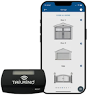

# TailWind Binding - Smart Garage Door Controller


This binding is used to enable communication between OpenHab and [TailWind's Smart Automatic Garage Controller](https://gotailwind.com/).


## Overview

The garage door controllers are automatically discovered.  

There is a single Thing created for each controller connected to the local Ethernet-WiFi network with channels that allow control of the doors (garage, gates, doors...) connected to the controller.

OpenHab linked channels will be updated regardless of whether the Tailwind's web/smarphone app, door remote or other integrations are used to configure, open or close doors.

Details for connecting to the controller's API server can be found on TailWind's GitHub site here: [Tailwind Local Control API](https://github.com/Scott--R/Tailwind_Local_Control_API)

## Testing

#### TailWind iQ3: 
 
<ul>
<li>using auto discovery and adding thing via inbox (<b>preferred</b>)</li>
<li>using manual configuration</li>
<li>using file based setup </li>
<li>via a direct Ethernet (LAN) connection with the iQ3 on same local network as the OpenHab server</li> 
</ul>  

## Supported Things


| Thing | Type | Description | Connection | Doors | Tested |
|:-:|:-:|:--|-------|:-:|:-:|
|  | iQ3 | Smart Automatic Garage Controller | Ethernet / WiFi | 3 | &#9989; Yes |

A Thing UID will have three components **bindingId** + **model** + **unique id** (the MAC address of the device). 

For example - **tailwind:iQ3:08d1f91202ec**

## Discovery

The binding can auto-discover the TailWind garage controllers present on your **local** network. Auto-discovery is enabled by default. To disable it, you can create a file in the services directory called tailwind.cfg with the following content:

```ruby
# Configuration for the tailwind binding
# 
# Auto discovery parameter 
# true to enable, false to disable  
org.openhab.tailwind:enableAutoDiscovery=false
```
This configuration parameter only controls the TailWind auto-discovery process, not the openHAB auto-discovery. Moreover, if OpenHAB's auto-discovery is disabled, the TailWind auto-discovery is disabled too.

Once added as a Thing, the user can control up to three doors per controller, similar to how they are controlled using TailWind's web or smartphone app.


## Thing Configuration

The TailWind controller thing has the following configuration parameters:

| Parameter | Parameter Id | Req/Opt | Description | Default | Type | Accepted Values |
| :--  | :-- | :-: | :-- | :-: | :-: | :-- |
| Number of Doors Controlled | doorCount | Required | The number of doors connected to the controller | 1 | Integer | 1, 2 or 3 |
| API Web Server Address/URL | webServerAddress | Required | Holds either the IP address or HTTP URL of the TailWind controller web server (API). Format for URL is tailwind-MAC address.local (i.e. tailwind-aa0b0cd0e0f0.local) | URL if auto-discovered, user provided if manually created. | String | Valid IP address or URL ending with .local | 
| Authorization token for the local API server on the controller | authToken | Required | Token obtained from the TailWind [Web Application](web.gotailwind.com). Instructions can be found here: [Token Instructions](https://github.com/Scott--R/Tailwind_Local_Control_API?tab=readme-ov-file#2-token)| Placeholder (123456) | String | Must not be blank and have 6 characters |
| <b>\*ADVANCED</b> |
| Door 1 Name\* | doorOneName | Required | Specify custom name for door one | Door 1 | String | Must not be blank or a duplicate of the other 2 door names |
| Door 1 Partial Open\* | doorOnePartialOpen | Required |Number of seconds to partially open this door | 2.5 seconds | Float | 0.5 - 15 seconds |
| Door 2 Name\* | doorTwoName | Required | Specify custom name for door two | Door 2 | String | Must not be blank or a duplicate of the other 2 door names |
| Door 2 Partial Open\* | doorTwoPartialOpen | Required |Number of seconds to partially open this door | 2.5 seconds | Float | 0.5 - 15 seconds |
| Door 3 Name\* | doorThreeName | Required | Specify custom name for door three | Door 3 | String | Must not be blank or a duplicate of the other 2 door names |
| Door 3 Partial Open\* | doorThreePartialOpen | Required |Number of seconds to partially open this door | 2.5 seconds | Float | 0.5 - 15 seconds |


>Note: Stared <b>*</b> items are hidden unless "Show advanced" checked on UI 

## Channels

TailWind Thing channels are listed by channel group (group name preceeds channel with a # sign).  

>When manually creating these channels, always use the group prefix to ensure the UI puts them together in the correct group.

**TailWind Controller**

| Label | Channel Type UID  | Item Type   | Read/Write | Description                  |
|:---------------|:------------------|:------------|:-----------:|:----------------------------|
| Number of Doors | controller#doorNum | Number | R | Number of doors being controlled. |
| Night Mode | controller#nightModeEnabled | Number | R | Night mode is enabled (can only be changed using TailWind app). 0=disabled, 1=enabled|
| Brightness | controller#ledBrightness | Dimmer | RW | Controls the brightness of the controller LED. Values from 0% - 100% |
| WiFi RSSI |controller#routerRssi | Number | R | Wi-Fi network received signal strength in dBm.  readings between Strong(-50) and Good(-67) are ideal. |
| <b>Advanced</b> |
| Model Number\* | controller#productID | String | R | TailWind device model number |
| Device ID\* | controller#deviceID | String | R | TailWind device ID (MAC address).  Format is unique to how TailWind stores this.  Each number pair is sepated by an underscore, if first digit of pair is zero (0) it is not included.  For example address AA:0B:0C:D0:E0:F0 would be represented as aa_b_c_d0_e0_f0. |
| Send Support Commands\* |controller#supportCommand | String | RW | Infrequently used support commands. Values: 'reboot' = reboot the controller device, 'blink' = identify the controller device by flashing white light three times. |
>Note: Stared <b>*</b> items are hidden unless "Show advanced" checked on UI 
</br>

**Door One**
| Label | Channel Type UID  | Item Type   | Read/Write | Description                  |
|:---------------|:------------------|:------------|:-----------:|:----------------------------|
| Door 1 Index | doorOne#index | Number | R | Door number index assigned by TailWind (0) |
| Door 1 Status | doorOne#status | String | R | Door status (open, close, lock, enable, disable, reboot) |
| Door 1 Door Control | doorOne#openClose | String | RW | Door control (open, partial, close) | 
| Door 1 Partial Open Time | doorOne#partialOpen | Number | R | Partial door open time in seconds (0.5 - 15).  Ony updated via Thing configuration. |
| Door 1 Locked Up Status | doorOne#lockup |Number | R | Door lockup (0 - not locked up, 1 = locked up) |
| Door 1 Is Configured | doorOne#disabled | Number | R | Door is in disabled state (0 - enabled, 1 - disabled).  Could mean no door is wired to the controller or it is wired but it was disabled using the smartphone app. |
</br>

**Door Two**
| Label | Channel Type UID  | Item Type   | Read/Write | Description                  |
|:---------------|:------------------|:------------|:-----------:|:----------------------------|
| Door 2 Index | doorTwo#index | Number | R | Door number index assigned by TailWind (1) |
| Door 2 Status | doorTwo#status | String | R | Door status (open, close, lock, enable, disable, reboot) |
| Door 2 Door Control | doorTwo#openClose | String | RW | Door control (open, partial, close) | 
| Door 2 Partial Open Time | doorTwo#partialOpen | Number | R | Partial door open time in seconds (0.5 - 15).  Ony updated via Thing configuration. |
| Door 2 Locked Up Status | doorTwo#lockup |Number | R | Door lockup (0 - not locked up, 1 = locked up) |
| Door 2 Is Configured | doorTwo#disabled | Number | R | Door is in disabled state (0 - enabled, 1 - disabled).  Could mean no door is wired to the controller or it is wired but it was disabled using the smartphone app. |
</br>

**Door Three**
| Label | Channel Type UID  | Item Type   | Read/Write | Description                  |
|:---------------|:------------------|:------------|:-----------:|:----------------------------|
| Door 3 Index | doorThree#index | Number | R | Door number index assigned by TailWind (1) |
| Door 3 Status | doorThree#status | String | R | Door status (open, close, lock, enable, disable, reboot) |
| Door 3 Door Control | doorThree#openClose | String | RW | Door control (open, partial, close) | 
| Door 3 Partial Open Time | doorThree#partialOpen | Number | R | Partial door open time in seconds (0.5 - 15).  Ony updated via Thing configuration. |
| Door 3 Locked Up Status | doorThree#lockup |Number | R | Door lockup (0 - not locked up, 1 = locked up) |
| Door 3 Is Configured | doorThree#disabled | Number | R | Door is in disabled state (0 - enabled, 1 - disabled).  Could mean no door is wired to the controller or it is wired but it was disabled using the smartphone app. |

## Full Example

_Provide a full usage example based on textual configuration files._
_*.things, *.items examples are mandatory as textual configuration is well used by many users._
_*.sitemap examples are optional._

### Thing Configuration

```java
Example thing configuration goes here.
```

### Item Configuration

```java
Example item configuration goes here.
```

### Sitemap Configuration

```perl
Optional Sitemap configuration goes here.
Remove this section, if not needed.
```

## Any custom content here!

_Feel free to add additional sections for whatever you think should also be mentioned about your binding!_
